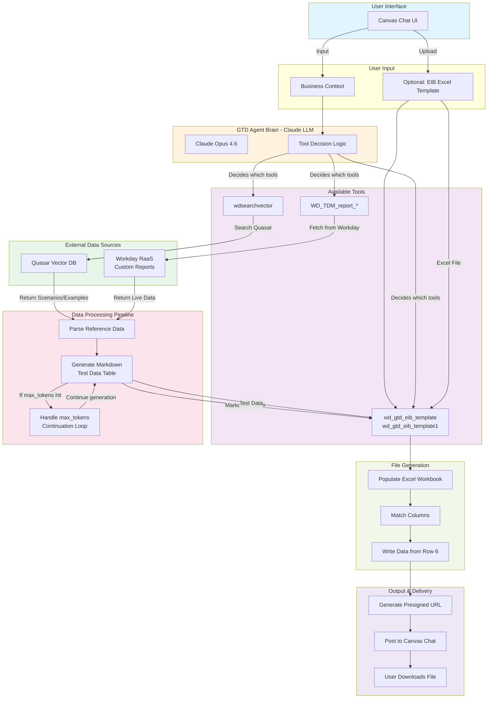
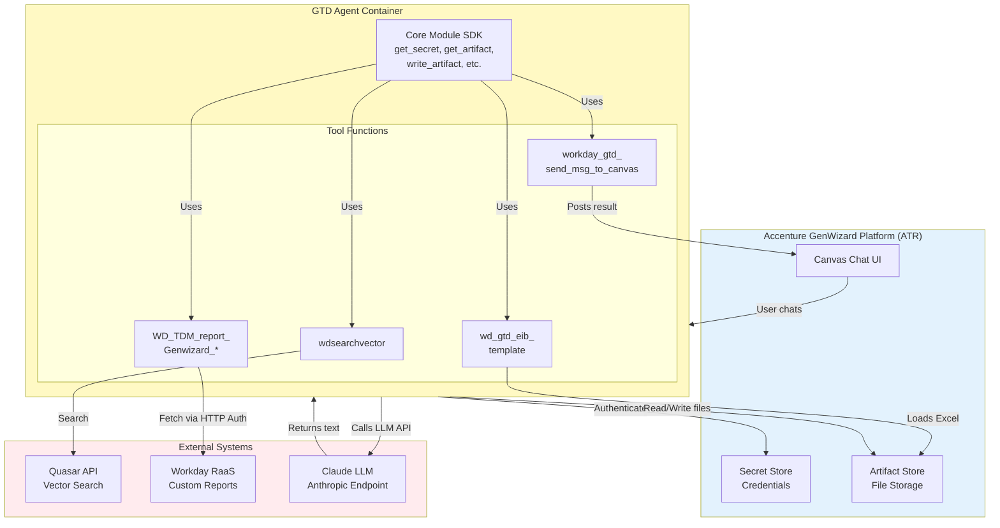
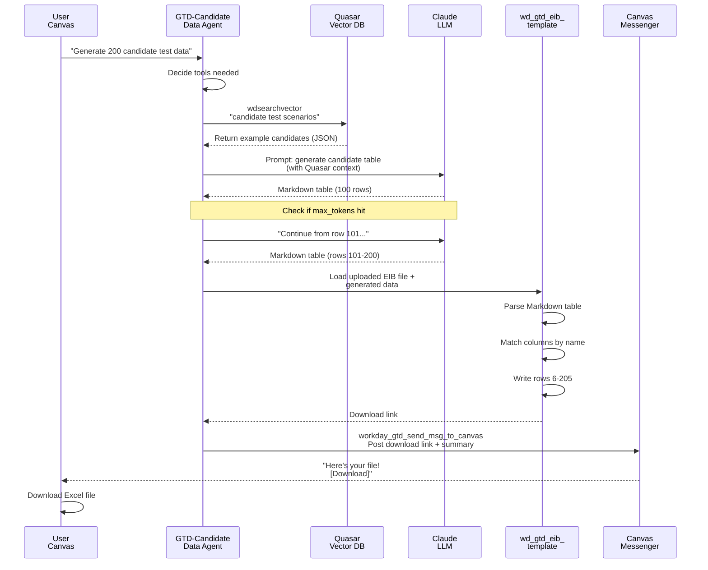

# GTD- Workday Generate Test Data

Welcome to the **GTD Repos** — a collection of GenAI agents that automatically generate **EIB (Enterprise Interface Builder) load templates** filled with test data for Workday HCM implementations.

---

## Overview

GTD agents produce **test data files** in Excel format, one agent per Workday business object. Each agent:

1. Optionally retrieves reference data from **Quasar** (vector search) and/or **Workday reports**
2. Uses Claude LLM to generate realistic test data in Markdown table format
3. Populates an uploaded EIB Excel workbook with the generated data
4. Returns a download link to the completed file

---

## The 7 GTD Agents

| Agent | Output File | Workday Object | TDW Pattern | Key Tools |
|-------|------------|-----------------|------------|-----------|
| **GTD-Assign Roles** | `Assign_Roles.xlsx` | Assign Roles / Role Management | TDW2 | `wd_gtd_eib_template`<br>`WD_TDM_report_GenwizardOrg_Mapping` |
| **GTD-Candidate Data** | `Candidate_Data.xlsx` | Candidate Profile | TDW5 | `wdsearchvector`<br>`wd_gtd_eib_template` |
| **GTD-Hire Data** | `Hire_Data.xlsx` | Hire / Offer Management | TDW6 | `wdsearchvector`<br>`WD_TDM_report_Genwizard_Applicant_ids`<br>`wd_gtd_eib_template` |
| **GTD-Job Requisition** | `Job_Requisition.xlsx` | Job Requisition | TDW1 | `wdsearchvector`<br>`wd_gtd_eib_template` |
| **GTD-JR** | `Job_Requisition.xlsx` | Job Requisition (variant) | TDW1 (variant) | `wdsearchvector`<br>`wd_gtd_eib_template1` |
| **GTD-Position Data** | `Position_Data.xlsx` | Position / Organizational Structure | TDW4 | `wdsearchvector`<br>`WD_TDM_report_GenwizardOrg_Mapping`<br>`wd_gtd_eib_template` |
| **GTD-Post Job** | `Job_Posting.xlsx` | Job Posting / Job Posting Template | TDW3 | `wdsearchvector`<br>`wd_gtd_eib_template` |

---

## Common Tools & Patterns

### Core Tool Functions

Each GTD agent folder contains a subset of these reusable tools:

#### `wdsearchvector`
- **Purpose:** Searches the Quasar vector database for test scenario definitions, business object examples, and reference data
- **Used by:** GTD-Candidate Data, GTD-Hire Data, GTD-Job Requisition, GTD-JR, GTD-Post Job
- **Output:** Structured reference data (JSON/Markdown) to seed the LLM data generation

#### `wd_gtd_eib_template` / `wd_gtd_eib_template1`
- **Purpose:** Core data-loading tool — populates an uploaded EIB Excel workbook with generated test data
- **Input:** Markdown table of test data from the LLM
- **Logic:**
  - Parses the Markdown table
  - Matches columns by normalized name
  - Skips the *Overview* sheet
  - Writes data starting from **row 6**
  - Returns download link
- **Used by:** All GTD agents

#### `WD_TDM_report_Genwizard_Applicant_ids` / `WD_TDM_report_GenwizardOrg_Mapping`
- **Purpose:** Fetch live data from Workday RaaS (Reporting as a Service) custom reports
- **Used by:**
  - `WD_TDM_report_Genwizard_Applicant_ids` → GTD-Hire Data
  - `WD_TDM_report_GenwizardOrg_Mapping` → GTD-Assign Roles, GTD-Position Data
- **Output:** Current Workday configuration / reference data to enrich generated test data

#### `workday_gtd_send_msg_to_canvas`
- **Purpose:** Posts the generated file's download link and summary back to the Canvas chat UI
- **Input:** Artifact path and file metadata
- **Output:** Chat message with clickable download link

---

## How GTD Agents Work

### Typical Flow

```
User inputs (business context, optional EIB file upload)
          ↓
Agent LLM decides which tool(s) to call
          ↓
[Optional] wdsearchvector → retrieve reference data from Quasar
[Optional] WD_TDM_report_* → fetch live Workday data
          ↓
LLM generates realistic test data (Markdown table format)
          ↓
wd_gtd_eib_template → writes data into EIB Excel workbook
          ↓
workday_gtd_send_msg_to_canvas → posts download link to chat
```

### The `max_tokens` Continuation Pattern

If Claude hits the token limit and returns `stop_reason == "max_tokens"`:
- The tool sends: *"Continue from exactly where you stopped, do not repeat the table header"*
- Claude resumes and appends the next batch of rows
- This repeats until the full table is generated

---

## Architecture & Workflow Diagrams

### 1. GTD Agent Workflow Diagram



### 2. System Architecture Diagram



### 3. Sequence Diagram: GTD-Candidate Data Example



### Key Architecture Concepts

#### **1. Layered Tool Architecture**
```
User Chat
    ↓
Agent LLM (decides WHICH tools to call)
    ↓
Tool Layer (platform SDK + specific functions)
    ↓
External APIs (Quasar, Workday, Claude)
```

#### **2. Data Flow Pattern**
```
Reference Data (Quasar/Workday)
    ↓ (enriches)
LLM Prompt + Context
    ↓ (generates)
Markdown Table
    ↓ (transforms)
Excel Workbook
    ↓ (delivers)
Download Link in Chat
```

#### **3. Token Management Pattern**
```
LLM generates table:
  ├─ Returns 100 rows (stop_reason: max_tokens)
  ├─ Agent sends: "Continue from where you stopped"
  ├─ LLM generates rows 101-200
  └─ Repeat until complete
```

---

## Data Load Targets (TDW Patterns)

Each output Excel file follows an EIB **TDW (Test Data Workbook)** template pattern:

| TDW Pattern | Object | Agent(s) | Rows | Typical Fields |
|------------|--------|---------|------|---|
| **TDW1** | Job Requisition | GTD-Job Requisition, GTD-JR | 100–500 | Requisition ID, Title, Department, Location, Headcount |
| **TDW2** | Assign Roles | GTD-Assign Roles | 50–200 | Role Name, Description, Permissions, Organization, Effective Date |
| **TDW3** | Job Posting | GTD-Post Job | 50–150 | Posting Title, Description, Requirements, Status, Posted Date |
| **TDW4** | Position Data | GTD-Position Data | 100–300 | Position ID, Title, Department, Manager, Cost Center |
| **TDW5** | Candidate Data | GTD-Candidate Data | 100–500 | Candidate ID, Name, Email, Skills, Status, Requisition Link |
| **TDW6** | Hire Data | GTD-Hire Data | 50–200 | Offer ID, Candidate ID, Position, Salary, Start Date, Status |

---

## Usage Guide

### Before Using Any GTD Agent

1. **Prepare an EIB Excel template** (or upload an existing one)
   - Must have sheets matching the target object (e.g., `Job_Requisition`, `Candidate_Data`)
   - Data rows begin at **row 6** (rows 1–5 are headers/metadata)
   - Column names must match EIB naming conventions

2. **Gather context** (optional but recommended)
   - Business unit or department constraints
   - Example data samples or naming patterns
   - Any Workday-specific rules (e.g., organization hierarchy, cost centers)

### Typical User Interaction

1. **Open the GTD agent in Canvas chat**
2. **Provide input:**
   - Optional: Upload an EIB Excel template (if you want to pre-populate specific fields)
   - Required: Describe what test data you need (e.g., *"Generate 200 candidates for the Engineering department"*)
   - Optional: Specify constraints or data patterns
3. **The agent:**
   - Calls `wdsearchvector` to find relevant scenarios/examples
   - Calls any `WD_TDM_report_*` tools if needed for live data
   - Uses Claude to generate a Markdown table of test data
   - Calls `wd_gtd_eib_template` to load the data into Excel
   - Posts the download link to chat
4. **Download and use** the generated file in your Workday EIB load

---

## Common Questions & Troubleshooting

### Q: Which GTD agent should I use?
**A:** Choose based on the Workday object you're testing:
- Job Requisitions → **GTD-Job Requisition** or **GTD-JR**
- Candidates → **GTD-Candidate Data**
- Hires/Offers → **GTD-Hire Data**
- Positions/Org Structure → **GTD-Position Data**
- Job Postings → **GTD-Post Job**
- Role assignments → **GTD-Assign Roles**

### Q: What if my Excel file doesn't populate?
**A:**
1. Verify the sheet name matches the expected output (e.g., `Candidate_Data` not `candidates`)
2. Check that data rows start at **row 6** (not row 1)
3. Ensure column headers are in normalized format (the tool matches `First Name` → `FirstName`)
4. Re-upload the file and try again

### Q: How many rows can be generated?
**A:** Typically 100–500 rows per request, depending on:
- LLM token limits and continuation loops
- Data complexity (more fields = fewer rows)
- User request specificity

### Q: Can I use live Workday data?
**A:** Yes! Agents that include `WD_TDM_report_*` tools fetch live data from Workday RaaS custom reports. This ensures test data aligns with your current org structure, valid cost centers, and other reference data.

### Q: What format should the Quasar search results be in?
**A:** `wdsearchvector` returns JSON or Markdown. The LLM automatically parses these results and uses them to seed realistic test data values.

---

## Integration with EIB

The generated Excel files are ready for **Workday EIB (Enterprise Interface Builder)** import:

1. Download the file from the Canvas chat link
2. Open it in Excel (or your EIB tool)
3. Verify the data layout (headers in rows 1–5, data from row 6)
4. Submit the file to your EIB integration endpoint
5. Monitor the EIB load job for success/errors

---

## Architecture Notes

### Platform Integration
- **Chat UI:** Canvas (ATR GenAI platform)
- **LLM:** Claude 3.5 Opus / 4.6 (via SCA_WA_Claude endpoint)
- **Knowledge Base:** Quasar (vector search API)
- **ERP System:** Workday (RaaS reports + XML)
- **File Storage:** Platform artifact store (presigned URLs)

### Performance Considerations
- **Parallel Claude calls:** Heavy pipelines use `ThreadPoolExecutor` to parallelize LLM requests
- **Token management:** `max_tokens` continuation loops handle long-running generations
- **Excel I/O:** `wd_gtd_eib_template` uses `openpyxl` for fast, reliable workbook manipulation

---

## Related Documentation

- **Parent project:** [Workday GenAI Testing](../README.md) — overview of all agents
- **GTS Repos:** [../GTS Repos/README.md](../GTS%20Repos/README.md) — test scenario/case generation
- **SA Repos:** `SA - Workday TestScenario CWB`, `SA-GTS_UserStory_Businessprocess` — scenario generation variants

---

## Questions or Issues?

- Review the tool docstrings in each agent folder
- Check Canvas chat history for example requests and outputs
- Refer to the main project README for platform architecture details
