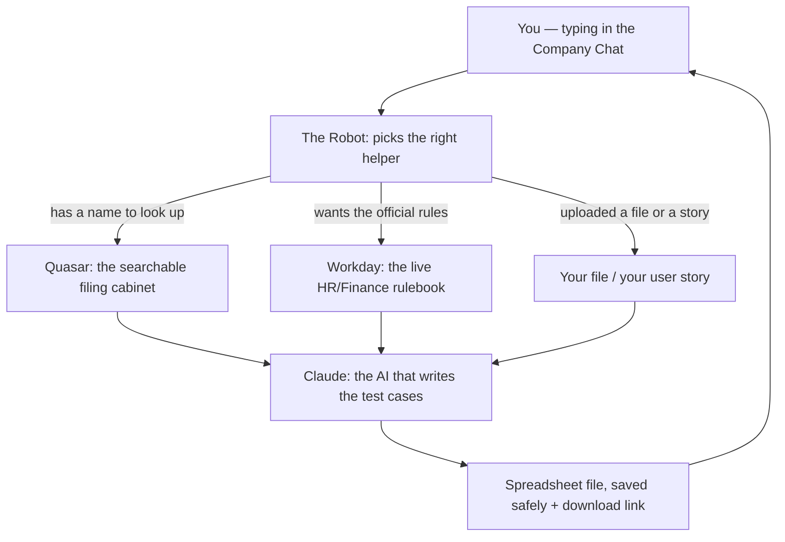

# GTS — The Workday Test-Case

> **Who is this for?** Everyone. A manager deciding if it's worth the money, a brand-new
> joiner who has never touched the code, or a curious 10-year-old. Every technical word is
> explained in plain brackets the first time it appears. If you get lost, jump to the
> **Word List** at the very bottom.

This one folder ("GTS Repos") holds **five closely-related helpers** that all do the same
basic job in slightly different ways. This README treats them as **one family** and explains
the whole thing together.

---

## Contents (click to jump)

1. [What Does This Do?](#section-1--what-does-this-do)
2. [The Story of How It Works](#section-2--the-story-of-how-it-works)
3. [What You Get Out of It](#section-3--what-you-get-out-of-it)
4. [What Can It Do? (The Five Helpers)](#section-4--what-can-it-do-the-five-helpers)
5. [The Big Picture](#section-5--the-big-picture)
6. [Before You Start (Your Checklist)](#section-6--before-you-start-your-checklist)
7. [How to Set It Up](#section-7--how-to-set-it-up)
8. [Settings You Need to Fill In](#section-8--settings-you-need-to-fill-in)
9. [What Could Go Wrong](#section-9--what-could-go-wrong)
10. [Why This Matters](#section-10--why-this-matters)
11. [Known Limitations and Watch-Outs](#section-11--known-limitations-and-watch-outs)
12. [Word List (Plain-English Dictionary)](#word-list-plain-english-dictionary)

---

## Section 1 — What Does This Do?

> **Why read this?** In 30 seconds you'll know what this thing is and whether it's worth caring about.

Imagine you had to sit down and hand-write a checklist of every single way to test a piece of
HR software — "what if the manager approves?", "what if a step is skipped?", "what if the new
hire is part-time?" — and write out fifty or a hundred of these, one careful step at a time.
That takes a skilled person **hours per process**, and it's easy to forget a case.

**This tool does that writing for you, in minutes.** You tell it the name of a
**business process** (a named task inside Workday — the big HR and finance software companies
use to hire people, change jobs, and run payroll), and it hands you back a finished
**spreadsheet** (a table you can open in Excel) full of ready-to-use test instructions.

Before this existed, testers wrote everything by hand. Now a robot writes the first full draft
and a human just reviews it. **Who uses it?** Software testers, quality checkers, and business
analysts on Workday projects — mostly at Accenture.

---

## Section 2 — The Story of How It Works

> **Why read this?** So you understand what's happening "behind the curtain" when you press go — no surprises.

Here is the journey, told as a story. There are a few different doors into the same house, so
we'll walk through the main one and then note the shortcuts.

When a tester types *"Generate test cases for Hire Employee"* into the company chat window, the
robot wakes up and first asks itself a simple question: **"Do I already have notes about this,
or do I need to go dig them up?"**

If notes already exist, it walks over to a big **searchable filing cabinet** (an internal
Accenture search system called **Quasar** that finds things by meaning, not just exact
spelling) and pulls out every pre-written scenario that matches "Hire Employee." If no notes
exist, it instead goes and reads the **live rulebook straight from Workday itself** — the
official, step-by-step definition of how "Hire Employee" actually runs — and figures out every
step in order.

Either way, once it has the raw material, it hands the work to **Claude** (the artificial-
intelligence writing assistant, built by a company called Anthropic — this is the "brain" that
actually writes the words). To go faster on big jobs, it doesn't ask Claude one question at a
time. It splits the work into small piles and sends **several piles to Claude at once** — like
having eight assistants each write a different chapter of a book at the same time instead of one
person writing all of it.

Claude writes each situation up as a proper test case: who does it, what they type in, the exact
steps, and what the correct result should look like — all in plain business English, with no
confusing computer codes. If Claude's answer ever gets cut off for being too long, the robot
politely says *"keep going from where you stopped"* until the whole thing is finished.

Finally, all the pieces are stitched together into one **spreadsheet file**, saved safely, and a
**temporary download link** (a private web address that stops working after a while, like a
locker that auto-locks) is dropped back into the chat for you.

---

## Section 3 — What You Get Out of It

> **Why read this?** So you know exactly what lands in your hands at the end — no vague "output."

At the end you receive **a download link in the chat**. Clicking it gives you a **CSV file**
(a plain spreadsheet that opens in Microsoft Excel or Google Sheets).

Inside that spreadsheet, **each row is one test case**, and the columns are roughly these:

- **Business Process Name** — which Workday task this test is for (e.g. "Hire Employee")
- **Test Case ID / Scenario ID** — a short code so each test can be tracked (e.g. `HE0001`)
- **Test Scenario** — a short title saying what this row is checking
- **Security Role** — which kind of user runs this test (e.g. "HR Partner", "Recruiter")
- **Test Data / Inputs** — the exact values a tester should type in
- **Test Case Description** — a couple of sentences on what makes this case special
- **Test Steps** — the full numbered list of actions, in order, start to finish
- **Expected Result** — what the tester should see after each step if it worked

The file is named with the date, time, and a chat ID so it never overwrites an old one, for
example: `HireEmployee_20260819_101500_abc123.csv`.

---

## Section 4 — What Can It Do? (The Five Helpers)

> **Why read this?** The family has five members. This tells you which one to reach for.

All five do "turn a Workday process into test cases," but they differ in **where they get their
information** and **how they talk to the AI**. Here they are in friendly terms.

### Helper 1 — "Expand the Ready-Made Library" (HR version)
**Folder:** `GTS Business Process` &nbsp;•&nbsp; **Also has:** a Workday-rulebook path (see Helper 2)

You give it a business process name. It searches the **filing cabinet** for pre-written HR
scenarios and asks the AI to turn each one into a full test case — several at a time for speed.
*Example:* ask for `["Hire", "Promote Employee"]` and get one spreadsheet covering both.

> This folder actually contains **three connected tools**: one for the library path above, and
> **two more** that together form the "read the live Workday rulebook" path — the first
> downloads the official process definition from Workday, and the second turns those steps into
> an exhaustive set of test cases covering every yes/no branch, shortest path, longest path,
> completion, and approval outcome.

### Helper 2 — "Expand the Ready-Made Library" (Finance version)
**Folder:** `GTS_TestCaseGeneration_BusinessProcess_Finance`

Exactly the same as Helper 1, but pointed at the **Finance** filing cabinet instead of the HR
one. Same steps, same result — just a different drawer of the cabinet. The tool names all end in
`_fin` so nobody mixes them up.

### Helper 3 — "Write Fresh Cases from a User Story"
**Folder:** `SA-GTS_UserStory_Businessprocess`

This one has **two ways in**. The first is the same library search as above. The second is
special: you paste in a **user story** (a short plain-English description of what someone needs,
written like *"As an HR Partner, I want to transfer an employee so the org chart updates"*), and
the AI **invents brand-new test cases from scratch** — no filing cabinet needed. Fresh scenario
codes start at `US0001`.

### Helper 4 — "Turn an Uploaded Spreadsheet into Test Cases"
**Folder:** `Workday Test Scenario Generator`

Here you **upload a spreadsheet** that lists the steps of a process (exported from Workday). The
tool reads it, hands it to the AI, and gets back the finished test cases. Handy when you already
have the step list in a file and don't want to search anything.

### Helper 5 — "The Heavy-Duty Uploader" (uses a different AI setup)
**Folder:** `SA - Workday TestScenario CWB`

Also takes an **uploaded spreadsheet**, but instead of asking the AI over the web, it actually
**installs and runs the Claude Code program on the server** (a command-line version of the AI
assistant) and drives it automatically to produce the test cases. It uses a different set of AI
login keys (Amazon's **Bedrock** service — a cloud that hosts AI models). Think of it as the
same goal reached with a bigger, more industrial engine under the hood.

---

## Section 5 — The Big Picture

> **Why read this?** One simple map so you can see how all the pieces fit together.



**This is You.** You type a request — a process name, a user story, or an uploaded file.

**This is The Robot.** Its job is to read your request and decide which of the five helpers fits.

**This is Quasar.** Its job is to be the filing cabinet — it finds pre-written scenarios that
match your process name, even if the wording isn't identical.

**This is Workday.** Its job is to be the source of truth — the real, live definition of how each
HR or finance process actually runs.

**This is Your File / Story.** Its job is to be the raw material when you'd rather bring your own
step list or description instead of searching.

**This is Claude.** Its job is to be the writer — it reads whatever raw material arrives and turns
it into clean, human-readable test cases.

**This is the Spreadsheet.** Its job is to hold all the finished test cases in one tidy table and
give you a link to download it.

---

## Section 6 — Before You Start (Your Checklist)

> **Why read this?** So you don't hit a wall halfway through. Tick these off first.

This is **not an app you install on your laptop.** It runs on an Accenture internal AI platform
(the code refers to web addresses containing `atr-gateway` and `acnopenai`).

- [ ] **A way into the company chat window** — the place you type your request. Ask your project
      lead for the address and a login.
- [ ] **The helpers must already be switched on** — an administrator must have published these
      tools on the platform. Confirm with your platform team that they're live.
- [ ] **For the library path:** the scenario library must already be loaded into the filing
      cabinet. Ask your platform team to confirm the HR file
      (`HCM_Test_Scenario_Library_Consolidated.xlsx`) and, for finance, the finance file are in place.
- [ ] **For the library or Workday path:** the exact process name. Small spelling differences can
      return nothing — use "Hire Employee", not "New Hire".
- [ ] **For the user-story path:** a written user story with as much detail as you can give.
- [ ] **For the upload helpers:** your step-list spreadsheet ready to upload.

> **New here?** Ask your lead one question: *"Do I have a name to look up, a story to describe, or
> a file to upload?"* That single answer tells you which helper to use.

---

## Section 7 — How to Set It Up

> **Why read this?** These steps are for the **platform team** deploying the tools. Everyday users
> only need chat access and can skip this.

**Step 1 — Get a copy of the code.**
Download or copy this whole `GTS Repos` folder onto the server where the platform runs. Each
sub-folder is one helper.

**Step 2 — Add the secret logins to the platform's safe.**
The platform has a locked digital safe (called a **secret vault**) for passwords and connection
details. Register the secrets listed in Section 8. If one is missing, the matching helper will
fail when it tries to connect.

**Step 3 — Install the small helper packages the code needs.**
Type this into the server's terminal (the black window where you type commands):

```bash
pip install requests pandas openpyxl
```

This tells the computer to download three helper packages: one for talking to the web
(`requests`), one for handling spreadsheet-style data (`pandas`), and one for reading Excel files
(`openpyxl`). You'll see text scroll by; at the end it should say "Successfully installed." If you
see a **red error**, jump to Section 9.

> **Note:** Helper 5 (`SA - Workday TestScenario CWB`) also needs the **Claude Code program** and
> **Node.js/npm** (a separate software toolkit) available on the server, because it installs and
> runs the command-line AI itself. Confirm with your platform team that npm is present.

**Step 4 — Register each tool file on the platform.**
Every code file inside these folders must be registered as a "tool" under an agent, following
your organisation's deployment guide. *We couldn't find that guide in these files — ask your
platform team.*

**Step 5 — Test with a simple request.**
Open the chat and type *"Generate test cases for Hire Employee."* If everything is wired up, you
should get a download link back within a few minutes. If you get an error, see Section 9.

---

## Section 8 — Settings You Need to Fill In

> **Why read this?** These are the "passwords and addresses" the tools need. Nothing works without them.

The tools do **not** read settings from a normal file. They read named **secrets** out of the
platform's locked safe. Below, each row is one secret you must register. **The actual values are
not in the code (which is correct and safe)** — get them from your platform team.

| What it is (plain English) | Secret name in the safe | What it holds | Used by |
|---|---|---|---|
| **The filing-cabinet login (Quasar)** | `wd-tool-secrets` | web address + username + password | Library & Workday paths |
| **The AI's login (Claude over the web)** | `SCA_WA_Claude_Opus_4_6` | AI web address, secret key, model name | Helpers 1–4 |
| **The Workday login** | `wd_dnt_10` | Workday address + username + password | Workday-rulebook path |
| **The AI's login (Amazon Bedrock)** | `Bedrock Sonnet 4.5` | region, access key, secret key, model | Helper 5 only |
| **The chat-reply login (default)** | `workday` / `workday_CUI` | address + username + password | The "send to chat" tools |
| **The chat-reply login (production/live)** | `workday_prod` / `cs_atr_prod` | address + username + password | The "send to chat" tools |
| **The chat-reply login (demo/dev/test)** | `workday_stgtest`, `convoui_cui_dev`, `cs-atr-stgtest`, `cs_atr_dev`, and similar | address + username + password | The "send to chat" tools |

> The chat-reply tools pick which of the above logins to use based on the "environment" you're
> pointing at (live, demo, test, and so on). Different helpers use slightly different secret
> names for the same idea — check the specific folder's original README if you're unsure.

> **Values we could not find in the code:** every actual URL, username, and password. That's by
> design. *Ask your platform team or the internal Accenture wiki.*

---

## Section 9 — What Could Go Wrong

> **Why read this?** Real problems, described the way a person would actually say them, with fixes.

**Problem:** *"I typed a process name but it said no scenarios were found."*
**Why:** The filing cabinet found nothing matching your spelling, or that process has no
pre-written notes yet.
**Fix:** Double-check the exact Workday name (spelling and capitals matter). Try a shorter version
("Hire" instead of "Hire Employee — Full-time"). If it's genuinely not in the library, switch to
the user-story path or the Workday-rulebook path instead.
*(Technical detail: the summary shows `"No matching scenarios after filter"`.)*

**Problem:** *"I asked for the Workday-rulebook path but it couldn't find the process."*
**Why:** Workday didn't return an entry named like *"Hire (default definition)"*.
**Fix:** Confirm the process exists in the finance/HR definition file and check the name.
*(Technical detail: the summary shows `"Reference Not Found"`.)*

**Problem:** *"The second step said it couldn't find the file from the first step."*
**Why:** The Workday-rulebook path is two stages. Stage two looks for a file left behind by stage
one, matched by the **same chat ID**. If you used a different ID (or skipped stage one), it can't
find it.
**Fix:** Run stage one first, and use the **exact same conversation ID** for stage two.

**Problem:** *"The download link says Access Denied or Expired."*
**Why:** The link is temporary and stops working after a while.
**Fix:** Re-run the request for a fresh link and download it right away.

**Problem:** *"It's been thinking for ages and never sent a file."*
**Why:** Big jobs across many processes take a few minutes. Some helpers work through piles one at
a time, which is slower.
**Fix:** Give it up to ~10 minutes. If nothing after 15, refresh the chat and try again with fewer
processes at once, or one at a time.

**Problem:** *"The AI login failed."*
**Why:** The AI's secret key is wrong, missing, or misconfigured.
**Fix:** Ask your platform team to check the relevant AI secret (`SCA_WA_Claude_Opus_4_6` for the
web helpers, or `Bedrock Sonnet 4.5` for Helper 5) has the right key, address, and model name.

**Problem:** *"The test cases look cut off at the end."*
**Why:** The AI hit its length limit. Most helpers automatically ask it to continue, but a couple
make only a single call and don't retry.
**Fix:** Re-run for just that one process or a more focused input; the next attempt usually
finishes cleanly.

---

## Section 10 — Why This Matters

> **Why read this?** For the manager deciding whether to keep funding this. Here's the value in plain numbers.

**Time saved.** Writing test cases for one Workday process by hand takes an experienced tester
**several hours**. This produces a full, structured draft in **under 10 minutes** — a saving of
roughly **90% or more** on the writing effort. A human still reviews it, but that review is
minutes, not hours.

**Fewer mistakes.** People get tired and skip cases. The robot systematically covers the yes/no
branches, the shortest and longest paths, completion, and approval outcomes — so scenarios are far
less likely to be missed.

**Consistency.** Ten people writing by hand produce ten different styles and depths. The AI applies
the same structure every time, which makes reviewing and comparing much faster.

**Flexibility.** Because the family offers a library lookup, a live-Workday read, a from-scratch
user story, and two upload paths, it fits teams at every stage — mature projects with a scenario
library and brand-new ones starting from nothing.

**What would happen without it?** Test teams would spend **days** writing documentation before they
could even begin testing. On a project with dozens of Workday processes, that's the difference
between a fast testing cycle and a slow one.

---

## Section 11 — Known Limitations and Watch-Outs

> **Why read this?** Being honest about the gaps, so nobody gets a nasty surprise in production.

We separate what we **know** from what we're **guessing**:
- ✅ **Confirmed** — seen directly in the code.
- 🔶 **Assumption** — a reasonable inference we can't fully prove from the files.

**✅ Confirmed — Some login details get printed into the server's log files.**
Several tools print connection details — and in at least one case a **password and username** —
into the server log (the running diary of everything the app does). Anyone who can read those logs
could see them in plain text. This is a security risk and should be fixed before live use.
*Recommended fix for the developers: remove those print lines or hide the sensitive values.*

**✅ Confirmed — Helper 5 runs the AI with safety prompts turned off.**
The heavy-duty uploader launches the command-line AI with a `--dangerously-skip-permissions` flag,
which lets it act without asking for confirmation. That's convenient on a controlled server, but
it should only run in a locked-down, trusted environment.

**✅ Confirmed — A couple of helpers don't retry if the AI's answer is cut off.**
Most helpers automatically ask the AI to continue when it stops early. The user-story path and the
upload helpers make a single call — so a very long or complex input can produce an incomplete file.

**✅ Confirmed — An outdated data function is used in places.**
Some code uses an older spreadsheet function (`applymap`) that has been marked for removal in newer
versions of the `pandas` package. On newer servers this may warn and could eventually break.
*Recommended fix: switch it to the newer equivalent (`map`).*

**✅ Confirmed — There are no automated tests in this folder.**
Every change must be checked by hand by running it through the chat. That raises the risk of a
change quietly breaking something.

**✅ Confirmed — Some connections are hard-wired to specific accounts.**
The Workday-rulebook path points at a specific report owned by a specific person. If that report
moves or is renamed, that path breaks.

**🔶 Assumption — This runs on an Accenture internal AI platform.**
Based on the web addresses in the code (`atr-gateway`, `acnopenai`) it looks like an Accenture
GenAI/GenWizard platform, but the files don't state this outright.

> **Things we simply couldn't find in the files:** the exact download-link expiry time, the maximum
> number of processes allowed in one request, and how new scenarios get added to the filing
> cabinet. *Ask your platform team or the internal wiki.*

---

## Word List (Plain-English Dictionary)

> Every technical term used above, explained simply. Look here anytime you get stuck.

| Term | Plain-English meaning |
|---|---|
| **Business Process** | A named task inside Workday — e.g. "Hire Employee", "Change Job", "Terminate Employee". |
| **Test Case** | A step-by-step instruction sheet telling a tester what to do, what to type, and what the right result looks like. |
| **Scenario** | One specific situation being tested — e.g. "hire a part-time employee with no benefits." |
| **Workday** | Big cloud software companies use to run HR, payroll, and finance. This tool writes tests for it. |
| **HCM** | "Human Capital Management" — Workday's HR side (hiring, job changes, terminations). |
| **Quasar** | Accenture's internal searchable filing cabinet that finds things by meaning, not exact spelling. |
| **Claude** | The artificial-intelligence writing assistant (made by Anthropic) that actually writes the test cases. |
| **Claude Code** | A command-line version of that AI assistant that runs as a program on a server (used by Helper 5). |
| **AI / Artificial Intelligence** | Software that can read and write in human language, here used to draft the test cases. |
| **CSV / Spreadsheet** | A simple table file that opens in Excel or Google Sheets; each row is one record. |
| **User Story** | A short plain-English wish written as *"As a [role], I want [action] so that [benefit]."* |
| **Security Role** | In Workday, what a person is allowed to do (e.g. "HR Partner" can start a hire). |
| **Secret / Secret Vault** | A locked digital safe on the platform holding passwords and keys, kept out of the code. |
| **Download Link** | A private web address for grabbing your file that expires after a set time. |
| **In Parallel** | Doing several things at once (like eight assistants working simultaneously) instead of one at a time. |
| **Log / Log File** | The running diary the software keeps of everything it does — useful for debugging, risky if it holds passwords. |
| **Bedrock** | Amazon's cloud service that hosts AI models; Helper 5 logs into the AI through it. |
| **Terminal** | The black command-line window where you type instructions to a computer. |
| **Environment** | A version of a system for a purpose — "dev" (for building), "test", and "prod" (the live one real users see). |

---

*This README was written by reading the actual code inside every folder of `GTS Repos`. All
✅ Confirmed points were seen directly in the source. All 🔶 Assumptions are clearly labelled.
For deeper, developer-level detail, see the original README inside each individual sub-folder.*
