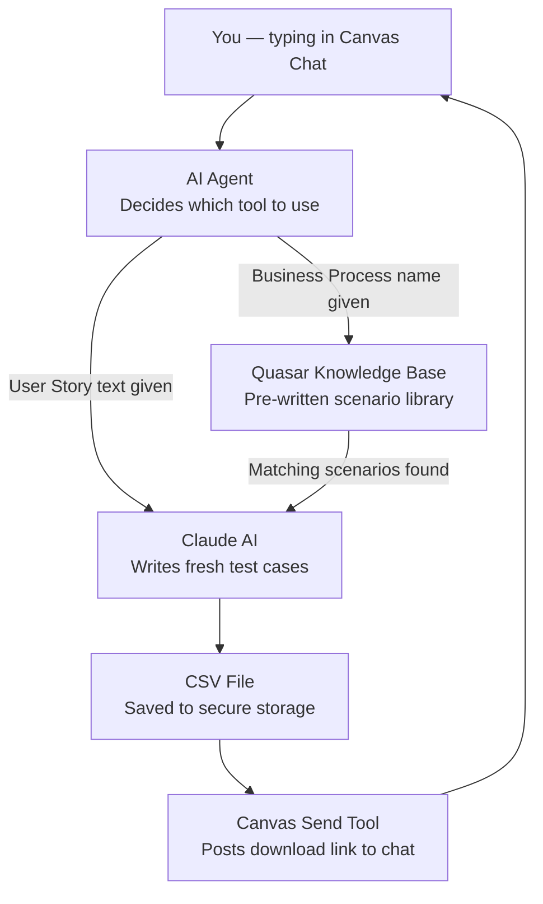

# SA-GTS User Story & Business Process Agent — Plain English Guide

> **Who is this guide for?** Anyone — managers, new joiners, testers, or curious colleagues.
> Every technical word is explained in plain brackets the first time it appears.
> If you're a developer looking for the original technical README, see `README.md` in this same folder.

---

## Section 1 — What Does This Do?

Imagine you had to manually write out every test case (a step-by-step instruction sheet that tells a tester exactly what to do, what information to enter, and what the correct result should look like) for a Workday (a popular business software for HR and payroll) process. That could take hours per process. This agent does it for you in minutes.

**The SA-GTS User Story Agent is a single AI-powered assistant that creates Workday test cases in two different ways**, depending on what you give it:

1. **You give it a Business Process name** — it looks up a library of pre-written scenarios and uses the AI to turn them into full, structured test cases.
2. **You give it a User Story** — a user story is a short plain-English description of what someone needs to do in the software (for example: *"As an HR Partner, I want to transfer an employee to a new department so that headcount is updated"*). The agent reads that story and creates fresh test cases from scratch, without looking anything up.

You interact with this agent through Canvas (a company chat interface — like a messaging app used inside the organization). You type what you need, and within a few minutes the agent sends back a ready-to-use file.

**Who uses it?** Workday implementation testers, QA (Quality Assurance — people who check that software works correctly) teams, and business analysts at Accenture.

---

## Section 2 — The Story of How It Works

This agent has two separate journeys depending on your request.

---

### Journey 1 — "I have a Business Process name"

When a tester says *"Generate test cases for Change Job"*, here is what happens behind the scenes.

First, the agent connects to **Quasar** (a knowledge base — think of it as a giant digital filing cabinet full of pre-written scenario notes, which can be searched by meaning, not just exact words). It logs in securely and searches for every scenario in the filing cabinet that matches the business process name you typed. The search looks specifically inside a file called `HCM_Test_Scenario_Library_Consolidated.xlsx` (HCM stands for Human Capital Management — Workday's HR module).

Once the matching scenarios are found, they are filtered down to only the ones that genuinely match your business process name. They are then grouped into batches of up to 40 scenarios at a time.

Each batch is handed to **Claude** (Anthropic's AI assistant — the writing engine behind this tool). Claude reads the scenario notes — things like the scenario name, description, expected result, and who initiates the action — and writes them up into proper, professional test cases with numbered steps, security roles (who is allowed to do each action in the system), and expected results clearly stated.

If the AI's response gets cut off because it is very long, the tool automatically asks it to continue from where it stopped, so nothing is lost.

All the batches are combined in order and saved as a single spreadsheet file (a CSV — a simple file format that opens in Excel). A temporary download link (which expires after a set time, like a locker that auto-locks) is sent back to you in the chat.

---

### Journey 2 — "I have a User Story"

When a tester pastes in a user story description and says *"Turn this into test cases"*, here is what happens.

The agent skips the Quasar filing cabinet entirely. Instead, it takes the user story text you provided — including the description and any acceptance criteria (the specific conditions that must be true for the story to be considered done) — and sends it directly to Claude.

Claude is instructed to write entirely new, original test cases based only on what you described. It does not copy anything from the library. It creates unique scenarios, assigns Scenario IDs starting from US0001, US0002, and so on, derives the security role from whoever is described as the "initiator" or "persona" in your story, and writes detailed step-by-step test instructions.

The result is saved as a CSV file and a download link is sent back to you in the chat.

---

## Section 3 — What You Get Out of It

At the end of either journey, the agent posts a download link in the chat. Clicking it gives you a CSV file (a simple spreadsheet you can open in Excel). Here is exactly what is in it:

**From Journey 1 (Business Process Library path):**

| Column | What it contains |
|---|---|
| Business Process Name | The Workday process you requested (e.g., "Change Job") |
| Test Scenario | A short name describing what is being tested |
| Security Role | Which type of user runs this test (e.g., "HR Partner", "Recruiter") |
| Test Data / Inputs | The specific values to enter during the test (e.g., Employee Name, Effective Date) |
| Scenario ID | The original ID from the scenario library |
| Test Scenario Description | A concise summary of what the test is checking |
| Test Steps | Numbered steps written in one paragraph — each action the tester must take |
| Expected Result | What the tester should see after completing the steps |

**From Journey 2 (User Story path):**

| Column | What it contains |
|---|---|
| Business Process Name | The process name you provided |
| Scenario ID | A unique code — US0001, US0002, US0003, and so on |
| Test Scenario | A name for each test scenario, created fresh by the AI |
| Security Role | Derived from who is described as the actor in your user story |
| Test Data / Inputs | Data values needed to run the test |
| Scenario Description | A summary of what this test covers |
| Test Steps | Numbered steps in one paragraph |
| Expected Result | The correct outcome for each step, in one paragraph |

The file is named in the format: `<yourfilename>_<date>_<time>_<conversationID>.csv`
For example: `ChangeJob_20250814_143022_abc123.csv`

---

## Section 4 — What Can It Do?

This agent contains **three tools** that work together.

---

### Tool 1 — "Look Up Library and Generate Test Cases"

**Technical name:** `wdquasarbp_to_testcases_csv`

*What it does:* Searches the Quasar knowledge base for pre-written scenarios matching the business process names you give it, then uses the AI to turn each scenario into a fully written test case.

*Real-life example:* You type "Hire Employee, Change Job, Terminate Employee." The tool finds all pre-written scenarios for each of those three processes, groups them into batches, sends each batch to Claude, and combines everything into one spreadsheet.

*What you give it:*
- The name(s) of the Workday business process(es) you want test cases for — you can provide one or many, separated by commas or as a list
- A base search configuration (this is normally handled by the platform — you don't set this manually)
- A name for your output file

*What you get:* A CSV file with one row per test case, covering every scenario found in the library for your requested processes.

*Performance note:* This tool processes scenarios one batch at a time (not in parallel — meaning not simultaneously). For very large process libraries, this may take several minutes.

---

### Tool 2 — "Generate Fresh Test Cases from a User Story"

**Technical name:** `wd_bp_quasar_to_workday_csv_us`

*What it does:* Takes a user story you type or paste and asks the AI to create brand-new, original test cases from it — no library search involved.

*Real-life example:* You paste in: *"As an HR Partner, I want to be able to transfer an employee to a different manager and cost center, so that the org chart reflects the change. Acceptance criteria: the transfer must be approved by the receiving manager; the effective date must be in the future."* The tool generates multiple test case scenarios covering all the conditions in that story.

*What you give it:*
- The name of the business process (e.g., "Transfer Employee")
- The full user story text — the description and acceptance criteria
- A name for your output file

*What you get:* A CSV file with fresh, unique test cases. Scenario IDs start at US0001 and count up. The AI will not generate duplicate or overly similar scenarios.

---

### Tool 3 — "Send the Result Back to the Chat"

**Technical name:** `workday_send_msg_to_canvas`

*What it does:* After the test case file is ready, this tool posts a message back to you in the Canvas chat window — including the download link for your file.

*What you give it:* Nothing directly — the agent calls this tool automatically after your file is ready.

*Environments it supports:* The tool can send messages to different versions of the Canvas platform (development/testing/production), and it selects the right login credentials automatically based on which environment is being used.

---

## Section 5 — The Big Picture

Here is how the pieces connect for this agent:



**This is You.** You type a request into the Canvas chat — either a business process name or a user story.

**This is the AI Agent.** Its job is to read your request and decide whether to search the library (Tool 1) or go straight to writing (Tool 2).

**This is the Quasar Knowledge Base.** Its job is to find pre-written scenario notes from the HCM scenario library that match the business process name you gave. It is only consulted on Journey 1 — not for user stories.

**This is Claude AI.** Its job is to read whatever scenario notes or user story text it receives and write professional, structured test cases in the correct format.

**This is the CSV File.** Its job is to hold all the generated test cases in one organised spreadsheet, saved securely on the platform's storage.

**This is the Canvas Send Tool.** Its job is to deliver the download link for your file back to you in the chat window.

---

## Section 6 — Before You Start

This agent runs on Accenture's **GenWizard / ATR platform** (a company-internal platform for building and running AI agents). It is not a standalone app you install on your computer. Before you can use it, you need the following:

- [ ] **Access to the Canvas chat interface** — This is the web chat window where you interact with the agent. Ask your project lead for the URL (web address) and a login account.
- [ ] **The agent must be deployed** — An administrator must have published this agent on the Canvas platform. Confirm with your project administrator that it is live and accessible.
- [ ] **For Journey 1 (Library path): the HCM scenario library must be loaded into Quasar** — The file `HCM_Test_Scenario_Library_Consolidated.xlsx` must already be indexed in the Quasar knowledge base. Ask your platform team to confirm this is in place.
- [ ] **For Journey 1: you need the exact Workday business process name** — The search matches by name. Slight spelling differences may return no results. Know the correct name before you start (e.g., "Hire Employee", not "New Hire").
- [ ] **For Journey 2 (User Story path): you need a written user story** — Prepare your user story with a description and acceptance criteria before starting. The more detail you provide, the better the test cases will be.

> **New to this?** If you just joined the project, ask your lead which journey fits your task: "Do I have a pre-written library to search, or am I starting from a user story?" That determines which path to take.

---

## Section 7 — How to Set It Up

> **Note:** These steps are for the platform team that deploys this agent — not for end users who simply chat with it. If you just want to use the agent, you only need Canvas chat access and can skip to the "Before You Start" section.

### Step 1: Get a copy of the code

Download or clone (make a copy of) this folder onto the server where the platform runs. The folder contains three tool files: `wdquasarbp_to_testcases_csv`, `wd_bp_quasar_to_workday_csv_us`, and `workday_send_msg_to_canvas`.

### Step 2: Register required secrets in the platform secret vault

The platform has a secure vault for storing passwords and connection details. You must add the following secrets before the agent will work. See Section 8 for exactly what each secret needs to contain.

Secrets to register:
- `wd-tool-secrets` — Quasar (knowledge base) login details
- `SCA_WA_Claude_Opus_4_6` — Claude AI connection details
- `workday_CUI` — Default Canvas platform login

And, depending on which environments you need to support:
- `cs_atr_prod`, `cs-atr-stgtest`, `cs_atr_dev`, `cui_sap_cred`, `atr_bg_cred`, `nextgencui`

If any secret is missing, the agent will return an error when it tries to connect.

### Step 3: Install Python package dependencies

The code uses several Python libraries (pre-built packages that add extra abilities to Python — like plug-ins). There is no official list file in this folder, so install the following manually.

Type this into a terminal (the command-line window where you type instructions to your computer) on the server:

```bash
pip install requests pandas
```

> **What does this do?** This tells Python to download and install two helper packages:
> - `requests` — lets the code make web requests (like a browser fetching a webpage)
> - `pandas` — lets the code work with spreadsheet-style data and export it to CSV
>
> You will see text scroll by as each package installs. When finished, it should say "Successfully installed." If you see a red error, check the troubleshooting section.

### Step 4: Upload the tool files to the GenWizard / ATR platform

Each of the three files in this folder needs to be registered as a "tool" under the agent definition in the GenWizard platform. Follow your organisation's agent deployment guide, or ask the platform team for instructions specific to your setup.

### Step 5: Test with a simple request

Once deployed, open Canvas and type:

> "Generate test cases for Hire Employee"

If everything is set up correctly, the agent should respond within a few minutes with a download link. If it returns an error instead, check Section 9.

---

## Section 8 — Settings You Need to Fill In

This agent does **not** use regular settings files. All credentials (passwords, keys, and connection details) are stored in the platform's **secure secret vault** — a locked digital safe kept separate from the code. Each entry below is one secret that must be registered in that vault.

| What it is | Secret name in the vault | Required fields | Notes |
|---|---|---|---|
| **Quasar knowledge base login** | `wd-tool-secrets` | `quasar_baseurl`, `quasar_username`, `quasar_password` | Only needed for Journey 1 (library path). Ask your platform team for values. |
| **Claude AI connection details** | `SCA_WA_Claude_Opus_4_6` | `Endpoint`, `api_key`, `deployment_name` | Needed for both journeys. Ask your platform team for values. |
| **Canvas platform login (default)** | `workday_CUI` | `url`, `username`, `password` | Used when no environment is specified, and for the "demo" environment. |
| **Canvas platform login (production)** | `cs_atr_prod` | `url`, `username`, `password` | Used when environment = "prod" |
| **Canvas platform login (staging/test)** | `cs-atr-stgtest` | `url`, `username`, `password` | Used when environment = "stagetest" |
| **Canvas platform login (development)** | `cs_atr_dev` | `url`, `username`, `password` | Used when environment = "dev" |
| **Canvas platform login (SAP CUI)** | `cui_sap_cred` | `url`, `username`, `password` | Used when environment = "sapcui" |
| **Canvas platform login (platforms-dev)** | `atr_bg_cred` | `url`, `username`, `password` | Used when environment = "platforms-dev" |
| **Canvas platform login (next-gen)** | `nextgencui` | `url`, `username`, `password` | Used when environment = "next-gen" |

> **Important:** Never store actual passwords or keys in a regular file or email. Always use the platform's secret vault UI (the on-screen interface for managing secrets). If you do not know where that is, ask your platform team.

> We couldn't find the actual URL values or account credentials in these project files. Ask your platform team or check the internal Accenture wiki for the real values.

---

## Section 9 — What Could Go Wrong

---

**Problem:** "I typed a business process name but the agent said no scenarios were found."

**Why this happens:** The Quasar search found nothing matching the name you typed. Either the spelling is slightly different from how it is stored in the library, or that process has no pre-written scenarios yet.

**Fix:**
1. Double-check the exact Workday name of the process — spelling and capitalisation matter (e.g., "Change Job" not "Job Change").
2. Try a shorter version of the name (e.g., just "Hire" instead of "Hire Employee — Full-time Exempt").
3. If the process genuinely isn't in the library, switch to Journey 2: write a user story description and use the User Story path instead.

*(Technical detail: the processing summary will show `"status": "No matching scenarios after filter"` for that business process)*

---

**Problem:** "I gave it a user story but got an error saying required columns are missing."

**Why this happens:** The AI wrote a response, but the columns it produced didn't include all the expected ones. This can happen if the user story was very short or lacked enough detail for the AI to infer security roles or test data requirements.

**Fix:**
1. Re-run with a more detailed user story — include who performs the action, what system fields are involved, and what the acceptance criteria are.
2. Explicitly mention the persona or role in your story (e.g., "As an HR Partner..." or "As a Finance Manager...") so the AI can derive the security role.

*(Technical detail: required columns checked are: `Business Process Name`, `Test Scenario`, `Security Role`, `Test Data/Inputs`, `Test Steps`, `Expected Result`)*

---

**Problem:** "I clicked the download link but it said 'Access Denied' or 'Link Expired'."

**Why this happens:** The download link is temporary — it expires after a set time. If you waited too long after receiving it in the chat, the link is no longer valid.

**Fix:** Re-run the request to get a fresh link. Download the file immediately after receiving it.

---

**Problem:** "The agent keeps thinking but never sends me a file — it's been over 10 minutes."

**Why this happens:** The library path (Journey 1) processes scenario batches one at a time. If there are many scenarios across multiple business processes, it can take several minutes. However, if nothing has arrived after 15 minutes, the connection may have timed out (been cut off for taking too long).

**Fix:**
1. Wait at least 10 minutes before assuming something is wrong.
2. If still nothing after 15 minutes, refresh Canvas and try again with fewer business processes at once.
3. Try one business process at a time to see if the issue is with a specific process.

---

**Problem:** "The test cases look like they cut off — the last scenario is incomplete."

**Why this happens (Journey 1):** The AI has a maximum number of "tokens" (units of text — roughly one word per token) it can produce in one response. The library tool uses a continuation loop — it automatically asks the AI to keep going if it stops early. Occasionally the handoff between continuations loses a small amount of content.

**Why this happens (Journey 2):** The user story tool makes only a single AI call with no continuation. If the AI hits its output limit mid-response, it stops without continuing. This is more likely with very complex user stories.

**Fix:** Re-run the request for just that one business process or with a more focused user story. The AI generates slightly different output each run, and the next attempt will usually complete cleanly.

---

**Problem:** "The Quasar connection failed with an authentication error."

**Why this happens:** The login credentials stored in the `wd-tool-secrets` vault entry are wrong, expired, or the Quasar account doesn't have search permission.

**Fix:** Ask your platform team to verify the `quasar_username` and `quasar_password` in the secret vault are still valid and that the account has access to the vector search endpoint.

---

## Section 10 — Why This Matters

For anyone deciding whether to continue using or expanding this agent:

**Time saved:** Writing test cases for a Workday business process manually takes an experienced tester several hours. This agent produces a structured, ready-to-review set of test cases in under 10 minutes — a saving of roughly **90% or more** on authoring time. A human still reviews the output, but that review is measured in minutes, not hours.

**Two paths mean broader coverage:** Because the agent supports both a curated library lookup and a from-scratch user story approach, it serves teams at different stages — those with mature, documented scenarios and those working on brand-new processes that haven't been tested before.

**Consistency:** When people write test cases manually, some write 3 steps and some write 15 for the same action. The AI applies the same depth and structure every time, which speeds up review and makes the test set easier to compare against previous runs.

**Traceability:** Scenario IDs are automatically generated and consistent (e.g., `US0001`) — making it easy to track which test cases were run in a testing cycle without manually numbering them.

**What would happen without it?** Test teams would spend days writing test documentation before they can even begin executing tests. On projects with many Workday processes, this is the difference between a rapid testing cycle and a prolonged one.

---

## Section 11 — Known Limitations and Watch-Outs

---

### Security Concerns

**Watch-out: Canvas platform passwords are printed into the server's log files.**

✅ **Confirmed (seen directly in the code):** Every time the agent sends a result back to the Canvas chat, the `workday_send_msg_to_canvas` tool prints the Canvas platform URL, username, and **password** to the server's log (the running record of everything the app does). The exact line in the code is:

```
print("Generating token for ", url_base, creds.get("password"), creds.get("username"))
```

This means **anyone with access to the server logs can read the Canvas login password in plain text.** This is a security risk and should be fixed before this tool is used in a production (live) environment.

**Recommended fix (for the development team):** Remove this `print` statement or replace it with a log entry that shows only the URL — never the password or username.

---

### Functional Limitations

**Journey 2 (User Story) does not retry if the AI output is cut off.**

✅ **Confirmed:** The library path (Journey 1) has a built-in loop — if the AI stops early, it automatically asks the AI to continue. The user story path (Journey 2) makes only a single AI call. If the AI hits its output limit mid-response, the test cases will be cut off without warning and the file will be incomplete. This risk increases with very long or complex user stories.

---

**The library path processes scenarios one batch at a time — not in parallel.**

✅ **Confirmed:** This tool works through scenario batches one after another (sequentially — in order, one at a time). Other similar agents in this toolkit process batches at the same time (in parallel — simultaneously), which is faster. For business processes with large numbers of scenarios, this tool will take longer than those agents. The batch size is set to 40 scenarios per batch, which is already optimised from an earlier value of 10.

---

**The `applymap` function used for data cleaning is outdated.**

✅ **Confirmed:** The code uses a function called `applymap` on a pandas DataFrame (a table of data in Python memory). This function was deprecated (marked as old and scheduled for removal) in pandas version 2.1. On newer servers with newer Python packages, this will generate warning messages and may eventually cause an error that stops the tool from producing output.

**Recommended fix (for the development team):** Replace `df.applymap(...)` with `df.map(...)`, which is the updated equivalent.

---

**The token for Canvas is generated fresh on every message — caching is disabled.**

🔶 **Confirmed (visible in code):** The Canvas messaging tool was designed to save the login token (a temporary access pass — like a wristband at an event) and reuse it, but that feature is commented out (switched off by placing `#` marks in front of the code). Instead, a brand-new token is generated every single time a message is sent. This is slightly slower but not harmful. It may cause additional load on the Canvas authentication service if messages are sent in rapid succession.

---

**No automated tests exist for this agent.**

✅ **Confirmed:** There are no automated test files in this folder. Every change to the code must be tested manually by running it through Canvas. This increases the risk that a code change breaks something that previously worked.

---

> **We couldn't find this in the project files:** The exact expiry time for download links, the maximum number of business processes that can be requested in one call, or documentation on how new scenarios are added to the HCM library in Quasar. Ask your platform team or check the internal Accenture wiki for these details.

---

*This README was generated from a direct reading of the code files in this folder. All ✅ Confirmed items were directly observed in the source code. All 🔶 Assumption items are inferences. For the original technical README with function signatures, see `README.md`.*

---

## Appendix A — Glossary

A quick-reference dictionary of every technical term used in this document, listed alphabetically. If you see a word in the main sections and want a plain-English reminder, look it up here.

| Term | Plain-English meaning |
|---|---|
| **Acceptance Criteria** | The specific conditions that must be true for a user story to be considered "done." Example: "The transfer must be approved by the receiving manager." |
| **Agent** | An AI-powered assistant that can understand a chat message, decide what actions to take, and carry them out automatically. |
| **API Key** | A password that one software application uses to prove its identity to another application. Like a VIP pass that lets the app through the door. |
| **Authentication / Auth** | The process of proving who you are before you are allowed access. Like showing your ID at the entrance. |
| **Batch / Chunk** | A group of items processed together. This tool groups scenarios into batches of 40 so the AI can process many at once rather than one at a time. |
| **Business Process** | A named sequence of steps in Workday — for example, "Hire Employee" or "Change Job." Each process has defined rules about who does what and in what order. |
| **Canvas** | The company's internal chat platform where users interact with AI agents. Think of it as a messaging app built for internal business use. |
| **Claude** | The AI assistant built by Anthropic that does the writing work in this tool. It reads scenario notes or user story descriptions and writes professional test cases. |
| **Continuation Loop** | A safety mechanism that automatically asks the AI to keep writing if it stopped mid-response because it hit its output limit. Journey 1 uses this; Journey 2 does not. |
| **CSV** | Comma-Separated Values — a simple spreadsheet file format that can be opened in Microsoft Excel or Google Sheets. Each row is one record; columns are separated by commas. |
| **Deprecated** | A technical feature that still works today but has been officially marked as "old" and will be removed in a future version. Code using deprecated features should be updated. |
| **Environment** | A version of a software system used for a specific purpose — for example, "dev" (development — where developers test changes), "stagetest" (staging — a dry run before go-live), and "prod" (production — the live system that real users access). |
| **HCM** | Human Capital Management — Workday's HR (Human Resources) module, which handles hiring, job changes, transfers, terminations, and similar people-management processes. |
| **Indexed / Index** | When documents are added to a search system so they can be found quickly. Like a book's index at the back — the system records where each piece of information lives so it can retrieve it fast. |
| **Library / Scenario Library** | A collection of pre-written test scenarios stored in Quasar, available for the tool to search and reuse. The specific file is `HCM_Test_Scenario_Library_Consolidated.xlsx`. |
| **Log / Log File** | A running record of everything an application does — like a diary the software keeps automatically. Useful for diagnosing problems, but a security risk if passwords appear in it. |
| **Parallel / In Parallel** | Doing multiple things at the same time — like having several assistants each write a different section of a document simultaneously. The opposite is "sequentially." |
| **Payload** | The actual content or data sent in a request — like the body of a letter as opposed to the envelope. In this tool, the "payload" is either the search configuration sent to Quasar or the user story text sent to Claude. |
| **Platform** | The underlying system (GenWizard / ATR) that hosts and runs the AI agents. Think of it as the operating environment — the "stage" on which the agents perform. |
| **Presigned URL / Download Link** | A temporary web address (URL) that gives you access to a file for a limited time. After that time, the link expires and no longer works. |
| **Python** | The programming language used to write this tool's code. It is a popular choice for AI and data work because it is readable and has many pre-built helper packages. |
| **Quasar** | Accenture's internal knowledge base (intelligent search and storage system). It understands the meaning of text, not just exact words, making it possible to find scenarios even with slightly different wording. |
| **Security Role** | In Workday, a security role defines what a person is allowed to do. For example, an "HR Partner" can initiate a hire, while a "Finance Manager" can approve budgets. Test cases must specify which role performs each action. |
| **Sequentially / One at a Time** | Processing items one after another — finish the first, then start the second. The opposite of "parallel." Journey 1 in this tool processes scenario batches sequentially. |
| **Short-Token / Auth Token** | A temporary digital pass generated after a successful login. Like a wristband at an event — it proves you were let in without needing to show your ID again for each ride. It expires after a set time. |
| **Secret Vault** | A secure, locked storage area on the platform that holds passwords, API keys, and other sensitive values. The code reads from it but the values are never visible in the source code itself. |
| **Scenario** | One specific situation being tested — for example, "Hire a part-time employee with no benefits." A business process can have many scenarios covering different conditions. |
| **Scenario ID** | A unique code assigned to each test scenario so it can be tracked and referenced. In Journey 1, IDs come from the library; in Journey 2, they are generated as US0001, US0002, and so on. |
| **TCP Connection** | A network connection between two computers used to send data reliably. Reusing the same connection (via `requests.Session`) is faster than creating a new one for every request. |
| **Terminal** | The black command-line window on a computer where you type instructions directly. Also called "command prompt" or "shell." |
| **Token (output)** | A unit of text that the AI processes — roughly equivalent to one word or part of a word. AI models have a maximum number of tokens they can produce in one response (16,000 in this tool). |
| **User Story** | A short plain-English sentence describing what a user wants to accomplish, written in the format: *"As a [role], I want to [action] so that [benefit]."* Used in Journey 2 as the input for generating test cases. |
| **Vector Search** | A type of search that understands the meaning of words — not just exact spelling. Quasar uses this to find scenarios that are relevant to a business process name even if the wording doesn't match exactly. |
| **Workday** | A cloud-based enterprise software platform used by companies to manage HR, payroll, and finance. This tool generates test cases specifically for Workday processes. |

---

## Appendix B — Quick Reference Card

A side-by-side summary of both journeys for fast reference.

| | **Journey 1 — Library Path** | **Journey 2 — User Story Path** |
|---|---|---|
| **When to use** | You have a Workday business process name and want test cases based on existing, curated scenarios | You have a user story description and want fresh, original test cases written from scratch |
| **What you give the agent** | Business process name(s) | Business process name + user story text (description + acceptance criteria) |
| **Does it search Quasar?** | Yes — searches `HCM_Test_Scenario_Library_Consolidated.xlsx` | No |
| **Does it call the AI?** | Yes — Claude expands each scenario into a full test case | Yes — Claude writes entirely new test cases from your story |
| **Scenario IDs in output** | Taken from the library (e.g., `SCN-001`) | Generated as US0001, US0002, US0003 … |
| **Processes in one request** | One or many (comma-separated or as a list) | One at a time |
| **How fast?** | A few minutes — scenarios are processed one batch at a time | A few minutes — single AI call |
| **What if AI output is cut off?** | Automatically retries and continues | Does not retry — output may be incomplete |
| **Output file name format** | `<filename>_YYYYMMDD_HHMMSS_<convid>.csv` | `<filename>_YYYYMMDD_HHMMSS_<convid>.csv` |
| **Where the file is saved** | `artifacts/` folder on the platform | `artifacts/` folder on the platform |
| **Tool name (for developers)** | `wdquasarbp_to_testcases_csv` | `wd_bp_quasar_to_workday_csv_us` |

---

## Appendix C — Output Column Reference

Full column descriptions for each journey's output file.

### Journey 1 — Library Path Output Columns

| Column name | What it contains | Where it comes from |
|---|---|---|
| **Business Process Name** | The Workday process you requested (e.g., "Change Job") | Added automatically by the tool from your input |
| **Test Scenario** | A short name for what is being tested | Taken from the library's "Scenario Name" field, refined by the AI |
| **Security Role** | Which type of user must perform this test (e.g., "HR Partner") | Derived by the AI from the "Initiator" field in the library scenario |
| **Test Data / Inputs** | The specific values to enter during the test (e.g., Employee Name, Effective Date) | Identified by the AI from the scenario description |
| **Scenario ID** | The original ID from the library (e.g., `SCN-001`) | Taken directly from the library record |
| **Test Scenario Description** | A summary of what the test is checking | Generated by the AI from the library's description field |
| **Test Steps** | Numbered steps written in one paragraph — every action the tester must take | Written by the AI based on the scenario |
| **Expected Result** | What the tester should see after completing the steps | Written by the AI based on the library's expected result field |

### Journey 2 — User Story Path Output Columns

| Column name | What it contains | Where it comes from |
|---|---|---|
| **Business Process Name** | The process name you provided | Taken directly from your input |
| **Scenario ID** | A unique code: US0001, US0002, US0003 … | Generated by the AI, starting at US0001 |
| **Test Scenario** | A name for each test scenario | Created fresh by the AI from your user story |
| **Security Role** | Which type of user must perform this test | Derived by the AI from the persona or role in your user story |
| **Test Data / Inputs** | Data values needed to run the test | Identified by the AI from your story's description and criteria |
| **Scenario Description** | A summary of what the test covers | Written by the AI |
| **Test Steps** | Numbered steps in one paragraph | Written by the AI from your user story details |
| **Expected Result** | The correct outcome, written in one paragraph | Written by the AI from your story's acceptance criteria |

---

## Appendix D — Secrets at a Glance

A consolidated reference of every secret the agent needs, what it contains, and which tool uses it. Use this when setting up the platform for the first time or when diagnosing a credentials-related error.

| Secret name | Fields inside it | Which tool uses it | When it is used |
|---|---|---|---|
| `wd-tool-secrets` | `quasar_baseurl`, `quasar_username`, `quasar_password` | `wdquasarbp_to_testcases_csv` | To log in to Quasar and search the scenario library (Journey 1 only) |
| `SCA_WA_Claude_Opus_4_6` | `Endpoint`, `api_key`, `deployment_name` | Both generation tools | To connect to Claude AI and generate test cases (both journeys) |
| `workday_CUI` | `url`, `username`, `password` | `workday_send_msg_to_canvas` | Default Canvas login — used when no environment is specified, and for "demo" |
| `cs_atr_prod` | `url`, `username`, `password` | `workday_send_msg_to_canvas` | Canvas login for the production (live) environment |
| `cs-atr-stgtest` | `url`, `username`, `password` | `workday_send_msg_to_canvas` | Canvas login for the staging / test environment |
| `cs_atr_dev` | `url`, `username`, `password` | `workday_send_msg_to_canvas` | Canvas login for the development environment |
| `cui_sap_cred` | `url`, `username`, `password` | `workday_send_msg_to_canvas` | Canvas login for the SAP CUI environment |
| `atr_bg_cred` | `url`, `username`, `password` | `workday_send_msg_to_canvas` | Canvas login for the platforms-dev environment |
| `nextgencui` | `url`, `username`, `password` | `workday_send_msg_to_canvas` | Canvas login for the next-gen environment |

> **How to read this table:** Each row is one "secret" — a named entry in the platform's secure vault. The "Fields inside it" column tells you what key-value pairs must be stored inside that secret entry. If any field is missing, the tool will fail at the step that needs it.
